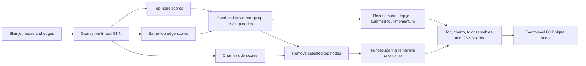

# Sparse Multi-Task GNN

Minimal reference implementation of the sparse message-passing GNN architecture.
It contains no graph extraction pipeline, detector configuration, training scheduler,
event classifier, plotting, or cluster-specific code.

## Architecture

The network learns a shared node representation and exposes three complementary
reconstruction heads. Event-level mean/max context helps each node use global event
information, while the symmetric edge head tests whether two nodes belong to the
same composite-object candidate.

1. A node encoder maps reconstructed node features into a common latent space.
2. Sparse edge-aware message-passing layers update every node from its neighbors.
3. Mean and max event pooling are concatenated back onto each node embedding.
4. Separate heads predict top-like nodes, charm-like nodes, and same-top edges.
5. A seed-and-grow decoder merges up to three top-prong nodes into one reconstructed
   top jet.
6. The highest charm score among the remaining nodes defines the recoil charm jet.
7. The reconstructed top, recoil charm, their pair observables, and GNN scores are
   packed into flat features for an interpretable event-level BDT.



## Input contract

```text
node_features : [number of nodes, node feature dimension]
edge_index    : [2, number of undirected edges]
edge_features : [number of edges, edge feature dimension]
batch_index   : [number of nodes], mapping each node to an event
```

Graph construction, labels, loss weighting, and train/validation/test splitting are
owned by the calling analysis.

## Usage

```python
from GNN.src import DecodeConfig, GraphBatch, ModelConfig, SparseMultiTaskGNN, decode_event

batch = GraphBatch(node_features, edge_index, edge_features, batch_index)
model = SparseMultiTaskGNN(
    ModelConfig(node_dim=34, edge_dim=6, hidden_dim=128, message_layers=4)
)
output = model(batch)
decoded = decode_event(
    output,
    p4=node_four_momenta,  # [nodes, 4] ordered as E, px, py, pz
    edge_index=edge_index,
    config=DecodeConfig(max_top_nodes=3),
)

top_nodes = decoded.top_node_indices
charm_node = decoded.charm_node_index
event_bdt_features = decoded.bdt_features
```

The decoder deliberately does not use truth labels. It turns the GNN predictions into
one reconstructed top candidate, one non-overlapping recoil-charm candidate, and a flat
numeric feature dictionary suitable for XGBoost or another event-level BDT.

Run the complete interface smoke test with `python GNN/smoke_test.py` from the
repository root.
