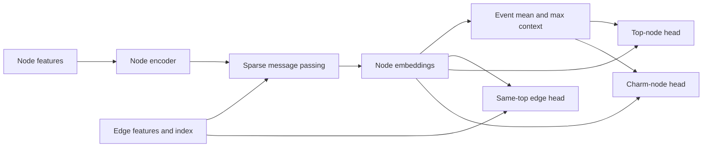

# Sparse Multi-Task GNN

Minimal reference implementation of the sparse message-passing GNN architecture.
It contains no graph extraction pipeline, detector configuration, training scheduler,
event classifier, plotting, or cluster-specific code.

## Architecture

The network learns a shared node representation and exposes three complementary
reconstruction heads. Event-level mean/max context helps each node use global event
information, while the symmetric edge head tests whether two nodes belong to the
same composite-object candidate.

1. A node encoder maps reconstructed node features into a common latent space.
2. Sparse edge-aware message-passing layers update every node from its neighbors.
3. Mean and max event pooling are concatenated back onto each node embedding.
4. Separate heads predict top-like nodes, charm-like nodes, and same-top edges.



## Input contract

```text
node_features : [number of nodes, node feature dimension]
edge_index    : [2, number of undirected edges]
edge_features : [number of edges, edge feature dimension]
batch_index   : [number of nodes], mapping each node to an event
```

Graph construction, labels, loss weighting, and train/validation/test splitting are
owned by the calling analysis.

## Usage

```python
from GNN.src.sparse_multitask_gnn import GraphBatch, ModelConfig, SparseMultiTaskGNN

batch = GraphBatch(node_features, edge_index, edge_features, batch_index)
model = SparseMultiTaskGNN(
    ModelConfig(node_dim=34, edge_dim=6, hidden_dim=128, message_layers=4)
)
output = model(batch)

top_probability = output.top_logits.sigmoid()
charm_probability = output.charm_logits.sigmoid()
same_top_probability = output.same_top_logits.sigmoid()
```

The model returns learned node embeddings as well as the three logits so downstream
analyses can build an interpretable event-level classifier without modifying the GNN.
